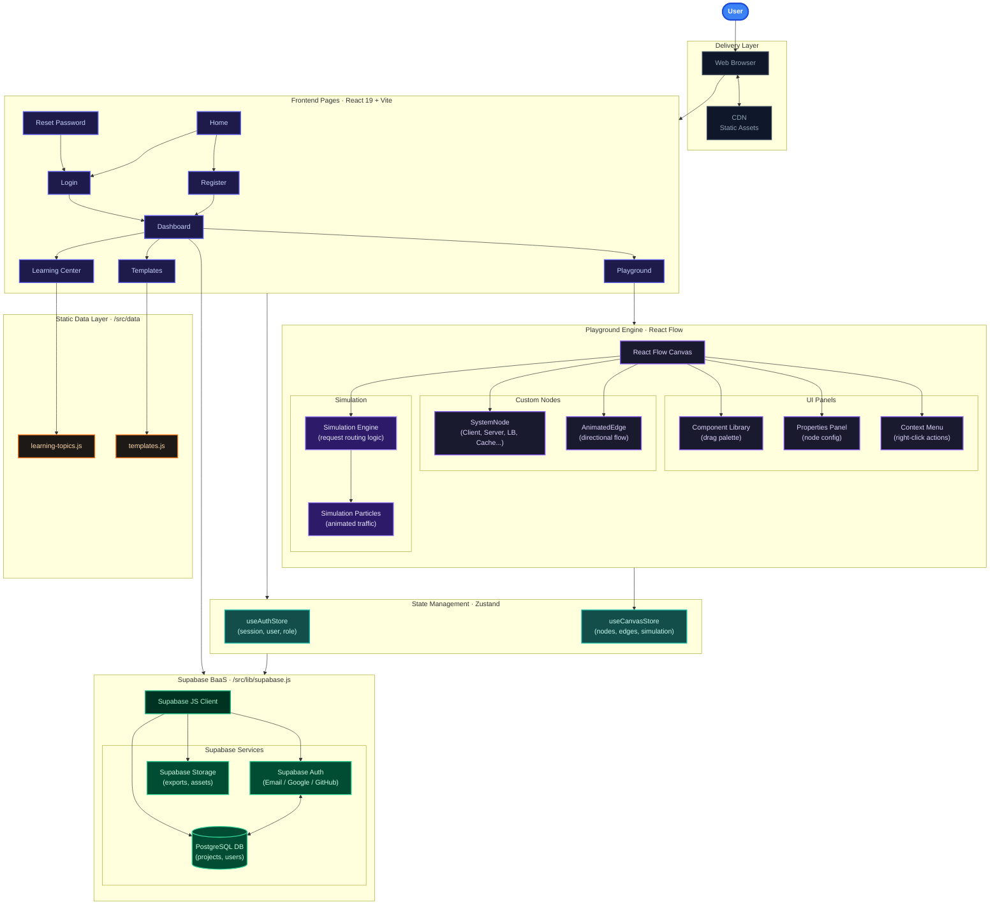
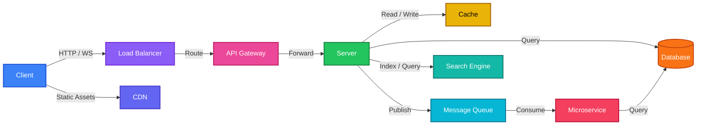

# SystemCanvas: System Design Playground

A modern web application for **learning, visualizing, designing, and simulating** distributed systems through interactive architecture diagrams and real-time simulations.

---

## Features

- **Interactive Canvas** — Drag-and-drop system design components onto a React Flow canvas
- **Real-time Simulation** — Watch particles flow through your system architecture
- **Multiple Components** — Clients, load balancers, API gateways, servers, caches, databases, message queues, CDNs, and more
- **Pre-built Templates** — Quickly start with popular architectures (URL Shortener, Instagram Clone, WhatsApp Clone, Netflix Clone, Uber Clone)
- **Learning Center** — Comprehensive resources on system design concepts
- **Metrics Dashboard** — Live metrics for requests/sec, latency, cache hit/miss, and more
- **Project Management** — Save, load, delete, and export your system designs to Supabase
- **Import/Export** — Export as JSON or PNG, import existing designs
- **Authentication** — Email/password, Google, and GitHub login

---

## Tech Stack

| Layer | Technology |
|---|---|
| Frontend Framework | React 19 + Vite |
| Styling | Tailwind CSS |
| State Management | Zustand |
| Diagramming | React Flow |
| Routing | React Router DOM |
| Icons | Lucide React |
| Backend-as-a-Service | Supabase (Auth + PostgreSQL + Storage) |

---

## System Architecture



---

## System Node Components



---

## Project Structure

```
system-canvas/
├── public/
│   └── vite.svg
├── src/
│   ├── assets/
│   ├── components/
│   │   ├── AnimatedEdge.jsx        # Directional animated edges
│   │   ├── AuthListener.jsx        # Supabase auth state sync
│   │   ├── ComponentLibrary.jsx    # Drag palette for system nodes
│   │   ├── ContextMenu.jsx         # Right-click canvas actions
│   │   ├── ProjectList.jsx         # Saved project management UI
│   │   ├── PropertiesPanel.jsx     # Node configuration sidebar
│   │   ├── SimulationEngine.jsx    # Request routing simulation logic
│   │   ├── SimulationParticles.jsx # Animated traffic particles
│   │   └── SystemNode.jsx          # Polymorphic system node renderer
│   ├── data/
│   │   ├── learning-topics.js      # Learning Center content
│   │   └── templates.js            # Pre-built architecture templates
│   ├── lib/
│   │   └── supabase.js             # Supabase client initialisation
│   ├── pages/
│   │   ├── Dashboard.jsx
│   │   ├── Home.jsx
│   │   ├── LearningCenter.jsx
│   │   ├── Login.jsx
│   │   ├── Playground.jsx
│   │   ├── Register.jsx
│   │   └── ResetPassword.jsx
│   ├── store/
│   │   ├── useAuthStore.js         # Auth state (Zustand)
│   │   └── useCanvasStore.js       # Canvas + simulation state (Zustand)
│   ├── App.jsx
│   ├── main.jsx
│   └── index.css
├── index.html
├── package.json
├── vite.config.js
├── tailwind.config.js
├── eslint.config.js
└── LICENSE
```

---

## Connect with Me

| Platform | Link |
|---|---|
| GitHub | https://github.com/maheshshinde9100 |
| LinkedIn | https://www.linkedin.com/in/maheshshinde9100 |
| LeetCode | https://leetcode.com/u/code-with-mahesh |

---

## License

This project is licensed under the **MIT License** — see the [LICENSE](LICENSE) file for details.
