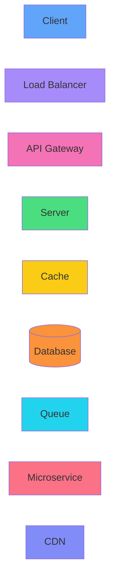

# SystemCanvas: System Design Playground

A modern web application for learning, visualizing, designing, and simulating distributed systems through interactive architecture diagrams and real-time simulations.

## Features

- **Interactive Canvas**: Drag-and-drop system design components onto a React Flow canvas
- **Real-time Simulation**: Watch particles flow through your system architecture
- **Multiple Components**: Clients, load balancers, API gateways, servers, caches, databases, message queues, CDNs, and more
- **Pre-built Templates**: Quickly start with popular architectures (URL Shortener, Instagram Clone, WhatsApp Clone, Netflix Clone, Uber Clone)
- **Learning Center**: Comprehensive resources on system design concepts
- **Metrics Dashboard**: Live metrics for requests/sec, latency, cache hit/miss, and more
- **Project Management**: Save, load, delete, and export your system designs to Supabase
- **Import/Export**: Export as JSON or PNG, import existing designs
- **Authentication**: Email/password, Google, and GitHub login

## Tech Stack

### Frontend
- React 19
- Vite (build tool)
- Tailwind CSS (styling)
- Zustand (state management)
- React Flow (diagramming)
- React Router DOM (routing)
- Lucide React (icons)
- Supabase JavaScript Client (BaaS)

## System Architecture

```mermaid
flowchart TB
    User[User]
    Browser[Web Browser]
    CDN[CDN]
    Browser <--> CDN
    Browser <--> AppFrontend[React App]
    AppFrontend <--> Supabase[Supabase BaaS]
    Supabase --> Auth[Supabase Auth]
    Supabase --> DB[(PostgreSQL DB)]
    Supabase --> Storage[Supabase Storage]
    Auth <--> DB
    
    style User[User]
    subgraph Frontend[Frontend Components]
    Home[Home Page]
    Login[Login Page]
    Register[Register Page]
    ResetPassword[Reset Password Page]
    Dashboard[Dashboard Page]
    Templates[Templates Page]
    Playground[Playground Page]
    LearningCenter[Learning Center Page]
    end

    subgraph State Management
    ReactFlow[React Flow Components]
    SystemNode[System Node]
    AnimatedEdge[Animated Edge]
    ComponentLibrary[Component Library]
    PropertiesPanel[Properties Panel]
    SimulationEngine[Simulation Engine]
    SimulationParticles[Simulation Particles]
    ContextMenu[Context Menu]
    end

    style User --> Browser
    Home --> Login
    Home --> Register
    Register --> Dashboard
    Dashboard --> Templates
    Dashboard --> LearningCenter
    Dashboard --> Playground
    Playground --> ReactFlow
    ReactFlow --> SystemNode
    ReactFlow --> AnimatedEdge
    ReactFlow --> ComponentLibrary
    ReactFlow --> PropertiesPanel
    ReactFlow --> SimulationEngine
    ReactFlow --> SimulationParticles
    ReactFlow --> ContextMenu
```

## Project Structure

```
system-canvas/
├── public/
│   └── vite.svg
├── src/
│   ├── assets/
│   │   └── react.svg
│   ├── components/
│   │   ├── AnimatedEdge.jsx
│   │   ├── AuthListener.jsx
│   │   ├── ComponentLibrary.jsx
│   │   ├── ContextMenu.jsx
│   │   ├── ProjectList.jsx
│   │   ├── PropertiesPanel.jsx
│   │   ├── SimulationEngine.jsx
│   │   ├── SimulationParticles.jsx
│   │   └── SystemNode.jsx
│   ├── data/
│   │   ├── learning-topics.js
│   │   └── templates.js
│   ├── lib/
│   │   └── supabase.js
│   ├── pages/
│   │   ├── Dashboard.jsx
│   │   ├── Home.jsx
│   │   ├── LearningCenter.jsx
│   │   ├── Login.jsx
│   │   ├── Playground.jsx
│   │   ├── Register.jsx
│   │   └── ResetPassword.jsx
│   ├── store/
│   │   ├── useAuthStore.js
│   │   └── useCanvasStore.js
│   ├── App.jsx
│   ├── main.jsx
│   └── index.css
├── index.html
├── package.json
├── vite.config.js
├── tailwind.config.js
├── eslint.config.js
└── LICENSE
```

## Mermaid Diagrams: System Components

### Client Node Types



## Connect with Me

- GitHub: https://github.com/maheshshinde9100
- LinkedIn: https://www.linkedin.com/in/maheshshinde9100
- LeetCode: https://leetcode.com/u/code-with-mahesh/

## License

This project is licensed under the MIT License - see the [LICENSE](LICENSE) file for details.
