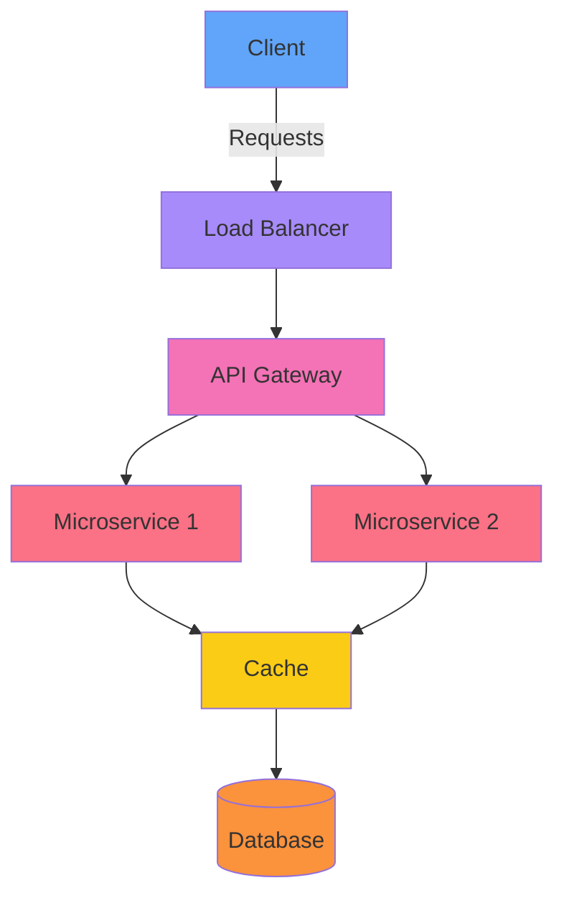
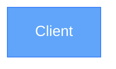
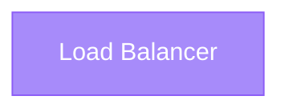
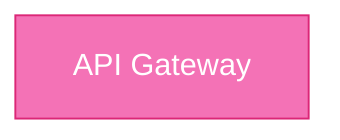
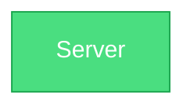
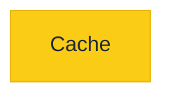
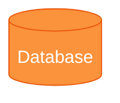
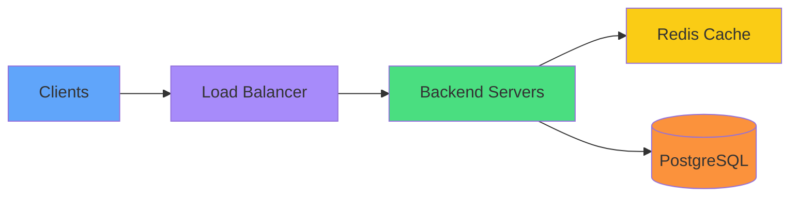
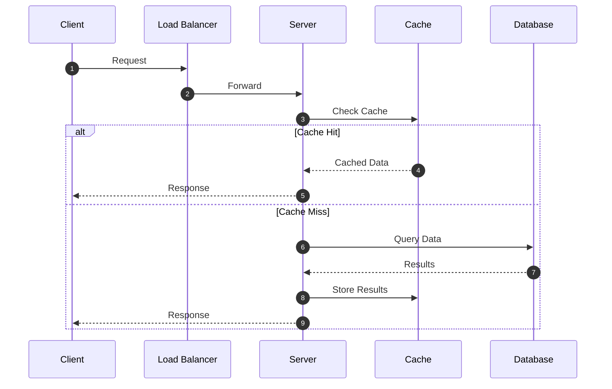

# System Design Playground

A modern web application for learning, visualizing, designing, and simulating distributed systems through interactive architecture diagrams and real-time simulations.

## Features

- **Interactive Canvas**: Drag-and-drop system design components
- **Real-time Simulation**: Watch how your system behaves with animated particles
- **Multiple Components**: Clients, load balancers, API gateways, servers, caches, databases, and more
- **Templates**: Pre-built system design templates to get started quickly
- **Learning Center**: Comprehensive tutorials and resources for system design
- **Metrics Dashboard**: Live metrics including requests per second, latency, and cache hit ratios
- **Project Management**: Save, load, and export your system designs
- **Import/Export**: Export as JSON or PNG, and import existing designs

## Tech Stack

### Frontend
- React 19
- Vite
- Tailwind CSS
- Zustand (State Management)
- React Flow (Diagramming)
- Lucide React (Icons)
- React Router DOM

### Backend & Infrastructure
- Supabase (Authentication, Database, Storage)

## Architecture Overview



## Components

### Client
Represents end-users sending requests to your system.



### Load Balancer
Distributes traffic across servers to ensure no single server is overloaded.



### API Gateway
Handles request routing, authentication, and rate limiting.



### Server
Backend servers processing requests.



### Cache
Stores frequently accessed data for faster retrieval.



### Database
Persists and retrieves data.



### Message Queue
Decouples services using asynchronous messaging.


## Example Architecture: URL Shortener



## Simulation Flow



## Getting Started

### Prerequisites
- Node.js
- npm or yarn
- A Supabase account

### Installation

1. Install dependencies:
   ```bash
   npm install
   ```

2. Start the development server:
   ```bash
   npm run dev
   ```

3. Open your browser and navigate to the local development URL (typically `http://localhost:5173`)

### Build for Production
```bash
npm run build
```

## Project Structure

```
system-canvas/
├── public/
├── src/
│   ├── assets/
│   ├── components/
│   │   ├── AnimatedEdge.jsx
│   │   ├── AuthListener.jsx
│   │   ├── ComponentLibrary.jsx
│   │   ├── ContextMenu.jsx
│   │   ├── ProjectList.jsx
│   │   ├── PropertiesPanel.jsx
│   │   ├── SimulationEngine.jsx
│   │   ├── SimulationParticles.jsx
│   │   └── SystemNode.jsx
│   ├── data/
│   │   ├── learning-topics.js
│   │   └── templates.js
│   ├── lib/
│   │   └── supabase.js
│   ├── pages/
│   │   ├── Dashboard.jsx
│   │   ├── Home.jsx
│   │   ├── LearningCenter.jsx
│   │   ├── Login.jsx
│   │   ├── Playground.jsx
│   │   ├── Register.jsx
│   │   └── ResetPassword.jsx
│   ├── store/
│   │   ├── useAuthStore.js
│   │   └── useCanvasStore.js
│   ├── App.jsx
│   ├── main.jsx
│   └── index.css
├── package.json
├── vite.config.js
└── tailwind.config.js
```

## License

MIT License
